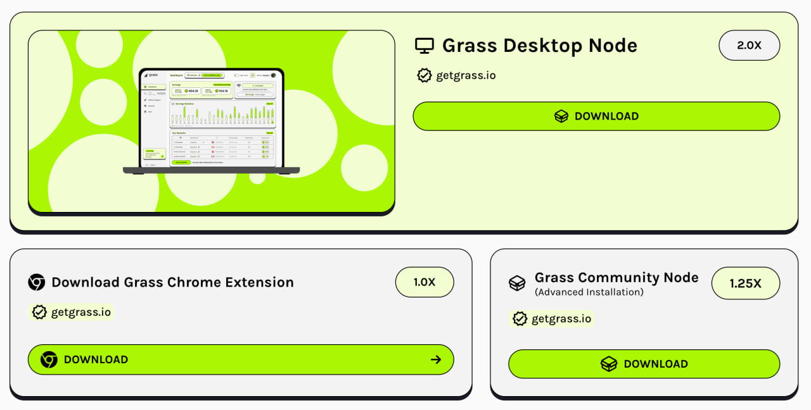

# GRASS EXTENSION NODE BOT



## Table Of Contents
- [GRASS EXTENSION NODE BOT](#grass-extension-node-bot)
  - [Table Of Contents](#table-of-contents)
  - [Prerequisite](#prerequisite)
  - [Join My Telegram Channel](#join-my-telegram-channel)
  - [BOT FEATURE](#bot-feature)
  - [GRASS EXTENSION NODE AIRDROP](#grass-extension-node-airdrop)
  - [Setup \& Configure BOT](#setup--configure-bot)
    - [Linux](#linux)
    - [Windows](#windows)
  - [Update Bot](#update-bot)
  - [IMPORTANT NOTE (READ IT THIS IS NOT DECORATION)](#important-note-read-it-this-is-not-decoration)
  - [CONTRIBUTE](#contribute)
  - [SUPPORT](#support)

## Prerequisite
- Git
- Node JS (v22)

## Join My Telegram Channel
```
                                                          
                      ...                                 
                     .;:.                                 
                    .;ol,.                                
                   .;ooc:'                                
            ..    .;ooccc:'.    ..                        
          .',....'cdxlccccc;.....,'.                      
         .;;..'';clolccccccc:,''..;;.                     
        ':c'..':cccccccccccccc;...'c:.                    
       ':cc,.'ccccccccccccccccc:..;cc:'                   
    ...:cc;.':cccccccccccccccccc:..:cc:...                
   .;';cc;.':;;:cccccccccccccc:;;;'.;cc,,;.               
  .cc':c:.',.....;cccccccccc;.....,..:c:'c:               
  ,x:'cc;.,'     .':cccccc:'.     ',.;cc':x'              
  lO,'cc;.;,       .;cccc:.       ,;.;cc';0l              
 .o0;.;c;.,:'......',''''''......':,.;c;.:0l.             
 .lxl,.;,..;c::::;:,.    .,:;::::c;..,;.,oxl.             
 .lkxOl..  ..'..;::'..''..'::;..'..  ..c0xkl.             
  .cKMx.        .;c:;:cc:;:c:.        .xMKc.              
    ;KX:         ;o::l:;cc;o:.        ;KK;                
     :KK:.       ,d,cd,'ol'o:       .:0K:                 
      ;0NOl:;:loo;. ... .. .;ldlc::lkN0:                  
       .lONNNKOx0Xd,;;'.,:,lKKkk0XNN0o.                   
         .','.. .lX0doooodOXd.  .','.                     
                 .,okkddxkd;.                             
                    'oxxd;.                               
   ........................................                              
   .OWo  xNd lox  xxl Ald   xoc dakkkkkxsx.              
   .OWo  o0W cXW  dM0 MMN   lNK laddKMNkso.               
   .kMKoxsNN oWX  dW0 MMMWO lWK    axM0   .                
   .OMWXNaMX dM0  kM0 MMKxNXKW0    axMk   .                 
   .OMk  dWK oWX XWdx Mxx  XMMO    akMx   .                 
   'OWo  dM0 'kNNXNNd DMD   OWk    aoWd   .                 
   ........................................

```           
                                              
                                              

Anyway i create new telegram channel just for sharing bot or airdrop, join here
[**https://t.me/skeldrophunt**](https://t.me/skeldrophunt).


## BOT FEATURE
- Single Account With Multiple Worker Based On proy
- Proxy Support (HTTP / SOCKS5)
- Auto Run Grass Node


## GRASS EXTENSION NODE AIRDROP
#NEW 

Grass Stage 2
If you not join on Grass Stage 1, don't forget to join Stage 2. 

Currently grass Stage 2 is on Epoch 1, idk it will run until how many Epoch

JOIN GRASS EPOCH 2 : https://app.getgrass.io/register/?referralCode=dVd4bPfawQRfeia

NODE : https://app.getgrass.io/dashboard/store

Make sure you use Static Residential Proxy not just Residential Proxy (Rotating) 

You can Get It from :
https://iproyal.com/?r=409724 4$ / Proxy (Im use Aus)

DWYOR

## Setup & Configure BOT

### Linux
1. Clone project repo
   ```
   git clone https://github.com/Widiskel/grass-node-bot.git && cd grass-node-bot
   ```
2. Run
   ```
   npm install && npm run setup
   ```
3. Configure your accounts
   ```
   nano accounts/accounts.js
   ```
4. Configure the proxy
   ```
   nano config/proxy_list.js
   ```
5. Run Bot
   ```
   npm run start
   ```
   
### Windows
1. Open your `Command Prompt` or `Power Shell`.
2. Clone project repo
   ```
   git clone https://github.com/Widiskel/grass-node-bot.git && cd grass-node-bot
   ```
3. Run 
   ```
   npm install && npm run setup
   ```
5. Navigate to `grass-node-bot` directory. 
6. Navigate to `accounts` folder and rename `accounts_tmp.js` to `accounts.js`.
7. Now open `acccounts.js` and setup your accounts.
8. Also Configure proxy if you want to use proxy, by open `proxy_list.js`. (if you have 5 accounts, proxy is required)
9.  Back to `grass-node-bot` directory.
10. To start the app open your `Command Prompt` or `Power Shell`
11. Run Bot
    ```
    npm run start
    ```

## Update Bot

To update bot follow this step :
1. run
   ```
   git pull
   ```
   or
   ```
   git pull --rebase
   ```
   if error run
   ```
   git stash && git pull
   ```
2. run
   ```
   npm update
   ```
2. start the bot


## IMPORTANT NOTE (READ IT THIS IS NOT DECORATION)

DWYOR

How can I get Teneo Points?
Read on this Article : [GRASS NODE REPUTATION SCORING](https://grass-foundation.gitbook.io/grass-docs/architecture/node-reputation-scoring)

**USE STATIC RESIDENTIAL PROXY**

If you want to regist a new account, make sure to use chrome with incognito or browser with no grass extension.

## CONTRIBUTE

Feel free to fork and contribute adding more feature thanks.

## SUPPORT

want to support me for creating another bot ?
**star** my repo or buy me a coffee on

EVM : `0x1f0ea6e0b3590e1ab6c12ea0a24d3d0d9bf7707d`

SOLANA : `3tE3Hs7P2wuRyVxyMD7JSf8JTAmEekdNsQWqAnayE1CN`
